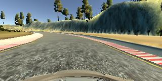
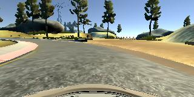

#**Behavioral Cloning** 

##Writeup. Alberto Vigata


---

**Behavioral Cloning Project**

[//]: # (Image References)

[image1]: ./examples/center_driving.jpg "Center driving"
[image3]: ./examples/r1.jpg "Recovery Image"
[image4]: ./examples/r2.jpg "Recovery Image"
[image5]: ./examples/r3.jpg "Recovery Image"
[image6]: ./examples/left.png "normal"
[image7]: ./examples/right.png "Flipped"
[image8]: ./examples/nvidia_model.png "Nvidia autonomous driving net model"


[image110]: ./examples/vis/cd/layer2_0.png "layer 2 output "
[image111]: ./examples/vis/cd/layer2_1.png "layer 2 output "
[image112]: ./examples/vis/cd/layer2_2.png "layer 2 output "
[image113]: ./examples/vis/cd/layer2_3.png "layer 2 output "
[image114]: ./examples/vis/cd/layer2_4.png "layer 2 output "
[image115]: ./examples/vis/cd/layer2_5.png "layer 2 output "
[image116]: ./examples/vis/cd/layer2_6.png "layer 2 output "
[image117]: ./examples/vis/cd/layer2_7.png "layer 2 output "
[image118]: ./examples/vis/cd/layer2_8.png "layer 2 output "
[image119]: ./examples/vis/cd/layer2_9.png "layer 2 output "
[image120]: ./examples/vis/cd/layer2_10.png "layer 2 output "
[image121]: ./examples/vis/cd/layer2_11.png "layer 2 output "
[image122]: ./examples/vis/cd/layer2_12.png "layer 2 output "
[image123]: ./examples/vis/cd/layer2_13.png "layer 2 output "
[image124]: ./examples/vis/cd/layer2_14.png "layer 2 output "
[image125]: ./examples/vis/cd/layer2_15.png "layer 2 output "
[image126]: ./examples/vis/cd/layer2_16.png "layer 2 output "
[image127]: ./examples/vis/cd/layer2_17.png "layer 2 output "
[image128]: ./examples/vis/cd/layer2_18.png "layer 2 output "
[image129]: ./examples/vis/cd/layer2_19.png "layer 2 output "
[image130]: ./examples/vis/cd/layer2_20.png "layer 2 output "
[image131]: ./examples/vis/cd/layer2_21.png "layer 2 output "
[image132]: ./examples/vis/cd/layer2_22.png "layer 2 output "
[image133]: ./examples/vis/cd/layer2_23.png "layer 2 output "

[image210]: ./examples/vis/af/layer2_0.png "layer 2 output "
[image211]: ./examples/vis/af/layer2_1.png "layer 2 output "
[image212]: ./examples/vis/af/layer2_2.png "layer 2 output "
[image213]: ./examples/vis/af/layer2_3.png "layer 2 output "
[image214]: ./examples/vis/af/layer2_4.png "layer 2 output "
[image215]: ./examples/vis/af/layer2_5.png "layer 2 output "
[image216]: ./examples/vis/af/layer2_6.png "layer 2 output "
[image217]: ./examples/vis/af/layer2_7.png "layer 2 output "
[image218]: ./examples/vis/af/layer2_8.png "layer 2 output "
[image219]: ./examples/vis/af/layer2_9.png "layer 2 output "
[image220]: ./examples/vis/af/layer2_10.png "layer 2 output "
[image221]: ./examples/vis/af/layer2_11.png "layer 2 output "
[image222]: ./examples/vis/af/layer2_12.png "layer 2 output "
[image223]: ./examples/vis/af/layer2_13.png "layer 2 output "
[image224]: ./examples/vis/af/layer2_14.png "layer 2 output "
[image225]: ./examples/vis/af/layer2_15.png "layer 2 output "
[image226]: ./examples/vis/af/layer2_16.png "layer 2 output "
[image227]: ./examples/vis/af/layer2_17.png "layer 2 output "
[image228]: ./examples/vis/af/layer2_18.png "layer 2 output "
[image229]: ./examples/vis/af/layer2_19.png "layer 2 output "
[image230]: ./examples/vis/af/layer2_20.png "layer 2 output "
[image231]: ./examples/vis/af/layer2_21.png "layer 2 output "
[image232]: ./examples/vis/af/layer2_22.png "layer 2 output "
[image233]: ./examples/vis/af/layer2_23.png "layer 2 output "

## Rubric Points
###Here I will consider the [rubric points](https://review.udacity.com/#!/rubrics/432/view) individually and describe how I addressed each point in my implementation.  

---
###Files Submitted & Code Quality

####1. Submission includes all required files and can be used to run the simulator in autonomous mode

My project includes the following files:
* model.py containing the script to create and train the model
* drive.py for driving the car in autonomous mode
* model.h5 containing a trained convolution neural network 
* writeup_report.md summarizing the results

####2. Submission includes functional code
Using the Udacity provided simulator and my drive.py file, the car can be driven autonomously around the track by executing 
```sh
python drive.py model.h5
```

####3. Submission code is usable and readable

The model.py file contains the code for training and saving the convolution neural network. The file shows the pipeline I used for training and validating the model, and it contains comments to explain how the code works.

###Model Architecture and Training Strategy

####1. An appropriate model architecture has been employed
Through an iterative process I ended choosing the Nvidia-style neural network architecture defined in lines 117-134. It's composed of five convolutional layers with RELU activations, and with increasing number of outputs. These CNN are used for feature detection.
Followed by a flatten layer, there are 4 fully connected layers for classification (125-133) plus the output layer for steering. They also have RELU output to add non-linearity to the model. 

Data is normalized using keras lambda layers (83-84) and includes a range normalization step and cropping the input picture to eliminate top and bottom parts of the image that are not relevant for training (84)


####2. Attempts to reduce overfitting in the model

The model contains dropout layers in order to reduce overfitting (model.py lines 125, 127,129, 131). 
The model was trained and validated on different data sets to ensure that the model was not overfitting (code line 38-56). The model was tested by running it through the simulator and ensuring that the vehicle could stay on the track.

####3. Model parameter tuning

The model used an adam optimizer, so the learning rate was not tuned manually (model.py line 141).

####4. Appropriate training data

Training data was chosen to keep the vehicle driving on the road. I used a combination of center lane driving, recovering from the left and right sides of the road, using side cameras and also flipping the input images.  See next section for details.

###Model Architecture and Training Strategy

####1. Solution Design Approach

The overall strategy for deriving a model architecture was to use a convolutional network with a feature identification section (first layers) and a feature selection/classification second section using fully connected layers. 

This was an iterative process. The first model tried, a simple LeNet network (91-100) seemed like a good first try. After multiple tries there were always problematic areas where the car would veer off the track. MSE and validation error were high so I decided to try a more involved model.


I chose the published Nvidia self-driving model and it performed instantly better in terms of MSE and validation error. My split for training and validation was 80/20 as seen on line 22 during the original process. 

Model converged quickly in one epoch to minimum validation errors, so usually 1-3 epochs were tried. I observed that increasing the number of epochs would almost always yield smaller MSE on the training set as epochs would progress, a clear sign of overfitting.

To further combat overfitting, on top of using few epochs, I added a few dropout layers as seen on 126-133.

Lots of effort was put into improving the data set using recovery data images, by recording only in the simulator the movement of the car veering from the side to the center with the right steering.


####2. Final Model Architecture
Final model selected was the Nvidia model as seen here and defined on my model.py (116-134):
![alt text][image8]

An effort was made to simplify the model, by removing the last conv layers and a few dense layers. The intent/spirit of this was the following: Because the NVidia model was used on real autonomous cars, a simpler model may suffice for our simulator environment and would help us avoid overfitting situations. Interestingly, the removal of the last conv layers had the unexpected consequence of **increasing enormously** the training time. This is due to the fact that by the last conv layers are highly subsampled versions of the input images, therefore reducing the number of training weights to an order of magnitude without them.


####3. Creation of the Training Set & Training Process

To capture good driving behavior, I first recorded two laps on track one using center lane driving. Here is an example image of center lane driving:

![alt text][image1]

Given that during test autonomous runs the car would be unable to recover from getting to close to the sides, I recorded 'recovery stretches' that would show the car how to get back to the center. Here is an example taken from the jpg output, recording a recovery from the left, in three snapshots. 

![alt text][image3]
![alt text][image4]
![alt text][image5]


- **If I was confident the recovery data was of high quality and the autonomous test would show model would still have problems recovery I'd augment the dataset by simply repeating the recovery features in the CSV file again instead of recording them again in the simulator. This has the effect of over representing the recovery stretches in the training set making sure the network will train them properly.**

- During preprocessing a full data set of the images were flipped to show a right leaning version of the track. Track 1 is mostly left steering, this way our network would learn how to do right steering too. This can be seen on lines 51-56.

![alt text][image6]
![alt text][image7]

After the collection process I ended with 9336 data points of which:
- given the 80/20 split 7468 for training 1868 for validation
- using left and center images multiplied features by 3
- flipping images multiplied features by 2
- for a total of 44808 training features which were shuffled. 
- total of 11208 for validation. 

Validation was used to gauge over or under fitting. Usually validation error would stall after 1-3 epochs, so 3 epochs was deemed sufficient. Adam optimizer was used so learning rate didn't need to be adjusted manually.

#####3.1 Use of python generators
A python generator supported by Keras was used due to stage the loading and preprocessing of features during training. This can be observed on lines 28-62. The original data set after all preprocessing and augmentation would occupy over 16GiB of RAM, while the generator method improves parallelism and minimizes RAM usage by loading and preprocessing features on the fly.

#####3.2 Track 2 issues
I was unable to completely finish the lap on track 2 without veering off the side. While the car drove through the most of the track without issues there would be a few areas that probably required further training.

####4. Model introspection
In order to understand better how our model was performing I visualize here the output of the first convolution layer to see what kind of activations are happening. This first layer has 24 outputs. 

Let's start with the following normal center driving image as stimulus to the network.



We peek into the model output through the code in 'model_inspect.py' using keras based tools and manual normalization of floating values to 8 bit pels. 
First convolution layer outputs are (size 31 x 138)

![alt text][image110]
![alt_text][image111]
![alt_text][image112]
![alt_text][image113]
![alt_text][image114]
![alt_text][image115]
![alt_text][image116]
![alt_text][image117]
![alt_text][image118]
![alt_text][image119]
![alt_text][image120]
![alt_text][image121]
![alt_text][image122]
![alt_text][image123]
![alt_text][image124]
![alt_text][image125]
![alt_text][image126]
![alt_text][image127]
![alt_text][image128]
![alt_text][image129]
![alt_text][image130]
![alt_text][image131]
![alt_text][image132]
![alt_text][image133]

If anything, we can clearly see how the neural network is being activated heavily by the borders of the road.

A far more interesting stimulus can be peeked with the following input. This center image corresponds to the exit of the bridge on the first track. A sharp left must be steered, and its complicated by visually different patterns on the side of the road.

This is the input image:



And these are the output of the first conv layer:

![alt text][image210]
![alt_text][image211]
![alt_text][image212]
![alt_text][image213]
![alt_text][image214]
![alt_text][image215]
![alt_text][image216]
![alt_text][image217]
![alt_text][image218]
![alt_text][image219]
![alt_text][image220]
![alt_text][image221]
![alt_text][image222]
![alt_text][image223]
![alt_text][image224]
![alt_text][image225]
![alt_text][image226]
![alt_text][image227]
![alt_text][image228]
![alt_text][image229]
![alt_text][image230]
![alt_text][image231]
![alt_text][image232]
![alt_text][image233]

Notice the asymmetrical activation on the output of the layer. It's not difficult to infer that the network uses this asymmetry in posterior layers to create a combination of weights that results in a hard steering to the left. Activations on these particular outputs may be affecting steering left. Also note how some of the outputs (1,2,3,5,... ) are effectively deactivated. 


